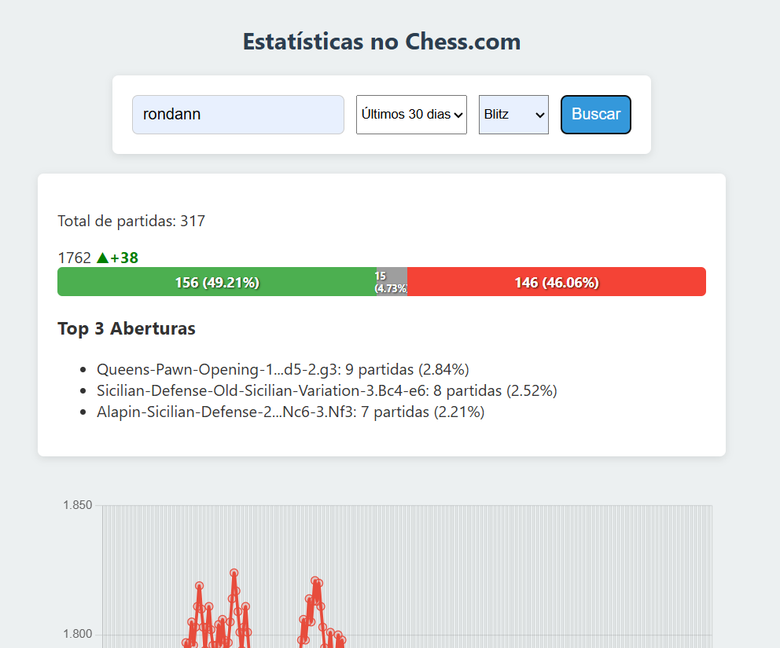

# chesscomstats

# Versões

## 1.1.8
- Ajuste para a diferença ficar colorida e de lado

## 1.1.7 
- Adição de Rating atual mostrando a diferença entre o último do range de dias.

## 1.1.6
- Ajuste para gráfico de barras com porcentagem e ficar no início

## 1.1.5
- Ajuste nas datas para corrigir os numeros de vitórias, empates e derrotas

## 1.1.4
- Grafico no início
- Ajuste nos ticks do gráfico de rating
- Ajuste de filtro para pegar apenas rules="chess"
- Mapeamento de vitórias, empates e derrotas

## 1.1.3
- Atualização para separar partidas por blitz, rapidas e bullet

## 1.1.2
- Atualização do gráfico de rating para evitar desajuste no eixo x
- Mudança no Range Select para 7, 30 e 90 dias

## 1.1.1
- Atualização do grafico para não repetir datas e mostrar todos os dias com dados

## 1.1.0
- Padronização do projeto

## 1.0.2
- Ajuste no Gráfico de rating, informando a quantidade de partidas por dia no eixo x

## 1.0.1
- Adição de css
- Adição de Gráfico de Rating por partidas

## 1.0.0
- COmmit inicial
